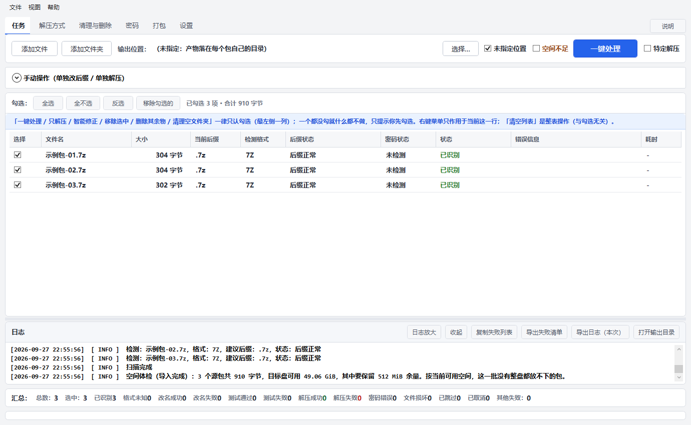
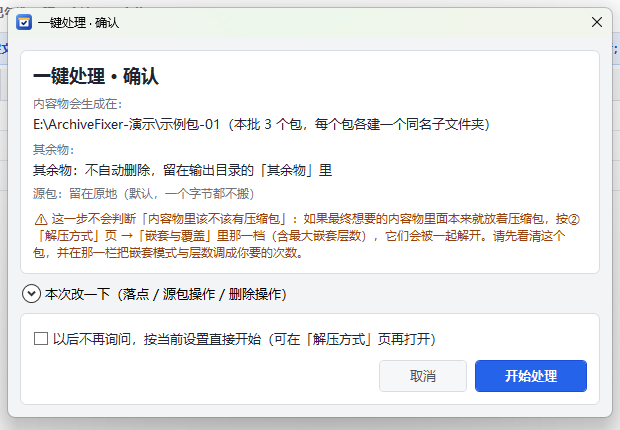
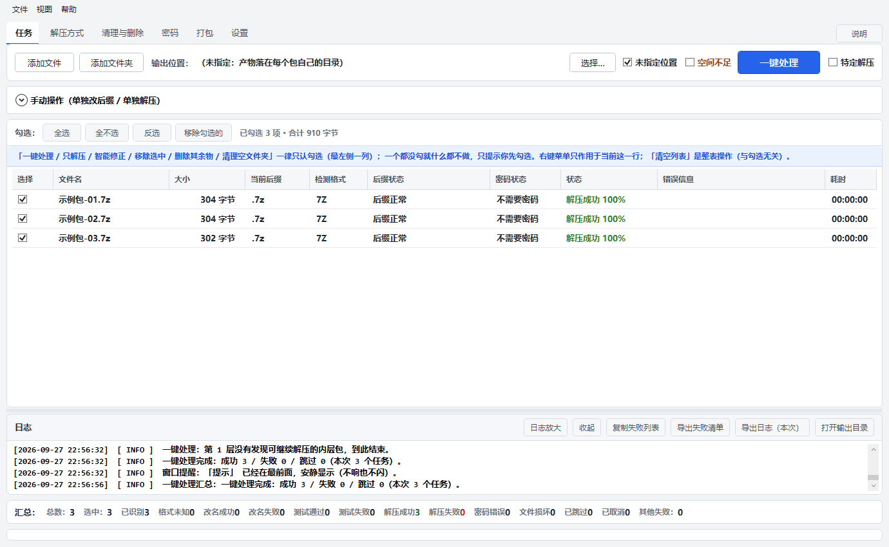

# ArchiveFixer

**把一批来源不明、后缀被改坏、加密、分卷、层层嵌套的压缩包，用最少的操作变成整理好、结果可追踪的文件。**

当前版本：**v0.1.0**（第一个对外版本，见 [CHANGELOG](CHANGELOG.md)）

Windows 桌面工具（C# / .NET 8 + WPF）· 中文单语 · 纯本地、不联网 · 绿色目录分发（解压即用，不写注册表）

---

## 30 秒上手

1. **拿到程序**：到 [**Releases**](https://github.com/klaraljy/ArchiveFixer/releases) 下
   `ArchiveFixer-0.1.0-setup.exe`（**安装包**，双击一路下一步，默认装到 `%LOCALAPPDATA%\ArchiveFixer`，
   会建快捷方式、控制面板里能卸载）、`ArchiveFixer-0.1.0-standalone.zip`（**独立版**，什么都不用装，解压即用）
   或 `ArchiveFixer-0.1.0-framework-dependent.zip`（**框架依赖版**，需 .NET 8 桌面运行时 x64，体积最小）；
   自己构建出的包在 `dist\`（`dist` 不入库），文件名是中文的
   `ArchiveFixer-0.1.0-框架依赖.zip` / `ArchiveFixer-0.1.0-独立.zip` / `ArchiveFixer-0.1.0-setup.exe`
   —— ⚠️ GitHub 会把资源名里的非 ASCII 字符抹掉，所以发布件用 ASCII 文件名、中文名挂在资源标签上。
   ⛔ 无论哪种装法，**都不要放进 `C:\Program Files\`**（程序要在自己目录下写 `data\`）。
2. **双击启动** → ①「任务」页点「**添加文件夹**」（也可以直接把文件夹拖进窗口）。
3. 勾上要处理的包 → 点「**一键处理**」→ 确认框里看一眼落点 → 确定。
4. 干完看①页结果区；失败的在 `ArchiveFixer-失败清单.txt`，要发给我排查看「**导出日志（本次）**」。

> 界面里那颗「说明」是最好的入口（功能详解 + 术语表，随程序走）；
> 想细看就再翻一遍 [`docs/使用说明.md`](docs/使用说明.md)（图文式逐页讲），
> 或者照着 [`docs/人工测试清单.md`](docs/人工测试清单.md) 走一遍。

---

## 长什么样

**① 导入一批包 → 自动识别**（不信后缀，只认文件头魔数 + 尾部内嵌归档）



**② 一键处理：动手之前把「落点 / 其余物 / 源包」三个决定讲清楚**（确认之后全程零弹窗）



**③ 跑完：成功一行一条、失败全留，批末汇总**



> 截图里是**生成的示例包**（3 个几十字节的假包，内容为 `说明-N.txt` + 一张示例图），不含任何真实数据。

---

## 能做什么（一行一条）

| 能力 | 一句话 | 细节 |
|---|---|---|
| 识别 | 不信后缀，只认**文件头魔数 + 尾部内嵌归档**；改了名的包照样认出来 | [功能一览](docs/功能一览.md) |
| 伪装后缀 | 算出真实格式后**先预览再改名**（绝不先删后移） | 同上 |
| 密码 | 密码本（列表式/映射式）+ 密码列表；**成功一次就复用**、按使用次数排序 | [使用说明 §7](docs/使用说明.md) |
| 解压 | 单层 / 递归展开 / 分卷组 / 加密包 / **双面文件**（图片或视频尾部挂归档，含 ZIP 直读） | [使用说明 §10](docs/使用说明.md) |
| 输出与整理 | 落点模型 v2（**一律不塌缩**，包名一层照建）、手动「解压到当前文件夹」、续解首尾必留、**其余物**（过程物 + 源包）一键清理三档 | [输出与整理模型](docs/输出与整理模型.md) |
| 打包 | 源（文件夹或单文件）→ 7z 加密分卷 → 加密外层；**确认之前一个字节都不动** | [打包功能](docs/打包功能.md) |
| 日志与报告 | **成功一行、失败全留**；可导出「本次操作」或全部历史日志；失败清单可直接发我 | [使用说明 §16](docs/使用说明.md) |
| 空间与并发 | 启动前按峰值算空间、不够不开始；导入完自动体检；跑的过程每 5 秒侦察一次、批末给空间曲线；并发数可调 | [使用说明 §12](docs/使用说明.md) |
| 界面说明 | 选项卡那一排最右端有一颗「说明」：**功能详解（16 条）+ 术语表**，程序自带、不依赖文件 | 程序内点「说明」 |

---

## 文档（想细看哪一块就点哪一块）

| 我想… | 看这里 |
|---|---|
| 从头学一遍怎么用 | [`docs/使用说明.md`](docs/使用说明.md) |
| 看功能全集（README 的详细版） | [`docs/功能一览.md`](docs/功能一览.md) |
| 查某个设置项是什么意思 | [`docs/设置项.md`](docs/设置项.md) |
| 知道"落点/其余物/删除三档"到底怎么定的 | [`docs/输出与整理模型.md`](docs/输出与整理模型.md) |
| 看打包是怎么做的（含 EULA 依据） | [`docs/打包功能.md`](docs/打包功能.md) |
| 看引擎（7-Zip / UnRAR / WinRAR）边界 | [`docs/引擎与外部工具.md`](docs/引擎与外部工具.md) |
| 提需求 / 看某个改动为什么这么做 | [`docs/需求变更.md`](docs/需求变更.md)、[`修改日志.md`](修改日志.md) |
| 自己测一轮（照着打勾） | [`docs/人工测试清单.md`](docs/人工测试清单.md) |
| 参与开发（规则、红线、验证口径） | [`AGENTS.md`](AGENTS.md) |

---

## 构建 / 运行 / 测试

```powershell
dotnet build ArchiveFixer.slnx                                          # 构建
dotnet run   --project src/ArchiveFixer/ArchiveFixer.csproj             # 运行（GUI）
dotnet test  tests/ArchiveFixer.Tests/ArchiveFixer.Tests.csproj         # 测试（必须全绿）
dotnet format ArchiveFixer.slnx --verify-no-changes                     # 格式检查
```

- 环境：**.NET SDK 8.0**（项目固定 8.0，不随新 SDK 漂移）、Windows 10/11。
- 内置工具：`src/ArchiveFixer/tools/7zip/`（LGPL，随程序分发）与 `tools/unrar/`（RARLAB freeware，允许随包分发）；
  **WinRAR 本体不随包分发**（共享软件），只检测与调用你自己装的那一份（见[引擎与外部工具](docs/引擎与外部工具.md)）。
- 运行时文件（exe/dll/pdb/json + `tools/`）拷到绿色目录即可用，**⛔ 不要动绿色目录里的 `data\`**（那是用户数据）。
- 当前测试规模与已知的偶发假红见 [`AGENTS.md` §11](AGENTS.md)。
- **出发行包**：`pwsh -File scripts/package.ps1`（框架依赖版）/ `pwsh -File scripts/package.ps1 -SelfContained`（独立版），
  产物在 `dist\ArchiveFixer-<版本>-<档>.zip`，脚本自带自检（四样关键文件齐 + 包里绝不含 `data\` / 日志 / 样本）。
  发行包用的是**发行档**（`-p:ArchiveFixerEdition=Release`）：①页那颗测试期专用的「不删原包」在发行包里不出现。

## 目录结构

```
ArchiveFixer.slnx          解决方案
src/ArchiveFixer/          工具本体（Domain/Detection/Engines/Password/Extraction/Security/Storage + WPF 界面）
tests/ArchiveFixer.Tests/  xUnit 测试（与本体分开；跑不起真 7z 的用例会自己跳过）
docs/                      使用说明 / 功能一览 / 设置项 / 需求变更 / 打包功能 / 人工测试清单 …
docs/images/               README 用的截图（用生成的示例包拍的，不含真实数据）
samples/                   测试样本的生成脚本 + 清单（样本本体不入库）
scripts/                   打包与自检脚本（暂不使用）
dist/                      发行产物（不入库）
```

## 已知限制（只列最要紧的，全文见 [`docs/使用说明.md` 附录 B](docs/使用说明.md)）

- **密码明文会出现在进程命令行**（`-p<密码>` 是 7-Zip / UnRAR 的固有限制）；日志、报告、清单层已脱敏，但任务管理器里能看到。
- **WinRAR 本体不能随包分发**（共享软件）→ 打包的外层 `.rar` 需要你自己装 WinRAR；没有时自动改用 7z（产物 `.7z`，绝不伪造 `.rar`）。
- **删源包 / 删其余物是不可逆的**：默认档什么都不删；要删得你自己在③页选「彻底删除」，且必须"解压成功 + 校验通过"才动。
- **不确定的包宁可不猜**：认不出来就报「格式未知」，不会乱指一个偏移去抠。
- 外接盘 / 网络路径未做专门适配（不做设备身份与断连恢复）。

## 许可证

本仓库是 **MIT**（见 [`LICENSE`](LICENSE)）。内置的 7-Zip（LGPL + unRAR restriction）与 UnRAR（RARLAB freeware）
各自的许可原文随包放在 `tools/*/` 下；分发前请按 [`docs/引擎与外部工具.md`](docs/引擎与外部工具.md) 复核一遍。

## 开发约定（摘要，全文见 [`AGENTS.md`](AGENTS.md)）

1. 界面只通过 ViewModel 调核心层；`Domain/Detection/Engines/Password/Extraction/Security/Storage` **不得引用 WPF**。
2. **默认不改源文件**；任何"删"都必须显式开启 + 成功 + 校验通过。
3. 改代码 = 构建 + 相关测试 + `dotnet format` 三样都过；**长活放后台**，别阻塞。
